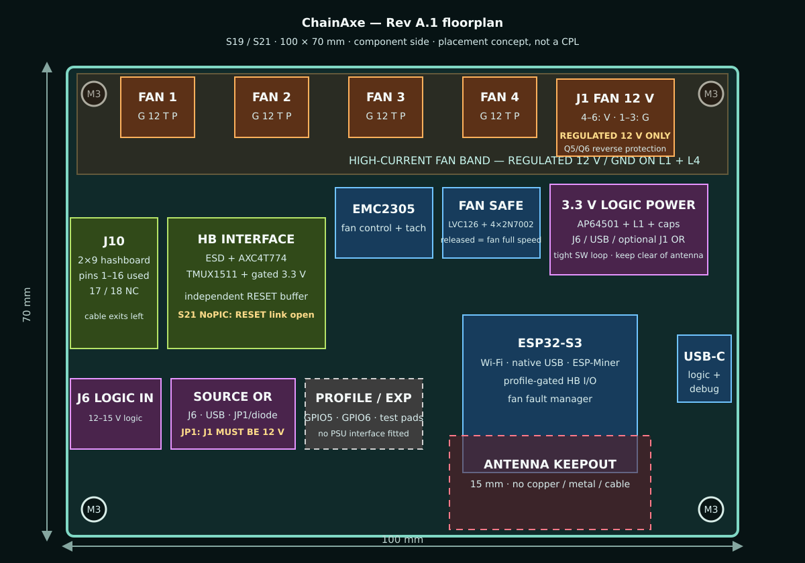
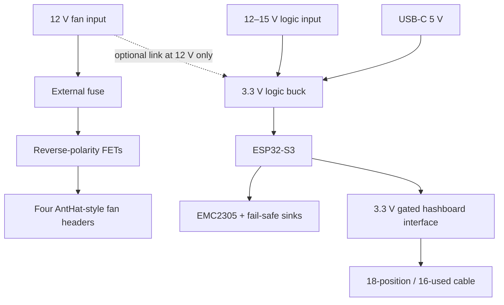

# ChainAxe — Rev A.1

Status: **engineering prototype; not a manufacturing release**  
Updated: 2026-08-16

ChainAxe is a clean-room ESP32-S3 controller for:

- one full S19- or S21-family Bitmain hashboard through the common data cable;
- four AntHat-style 12 V, four-wire Antminer fans with tach feedback and fail-safe full-speed startup;
- a 12–15 V low-current controller input; and
- native USB, Wi-Fi, and an ESP-Miner-derived mining application.

ChainAxe is an independent open-hardware project and is not affiliated with or endorsed by Bitmain. Antminer is a trademark of its respective owner.

The name refers to the complete ASIC hash chain controlled by the board. ChainAxe supersedes the earlier FT4232HQ-based **bitcrane** prototype with a clean ESP32-S3 architecture intended to run ESP-Miner directly.

There is **no PSU communication interface in Rev A.1**. Hashboard ASIC/core power remains on its normal external bus bars or bench supply. The ESP board communicates only through the hashboard data cable and drives the four fan connectors.

## Connector interpretation

The retained hashboard connector is physically **2×9 / 18 positions**. Pins 1–16 are used and positions 17–18 are NC, which explains the shorthand “16-pin header.” The user has confirmed this interface is compatible across the intended S19/S21 targets, so Rev A.1 standardizes the cable-side logic domain at 3.3 V and removes the previous target-voltage population matrix.

Compatibility here means the connector and electrical interface are shared. Firmware must still select the correct ASIC family, chip count, address stride, baud sequence, reset policy, and voltage/temperature-control path for the exact hashboard SKU.

## What is here

| Area | Deliverable |
|---|---|
| Architecture | Rail, signal, safety, and power-up decisions in `docs/architecture.md` |
| Target matrix | S19/S21 ASIC/profile scope in `docs/target-matrix.md` |
| Interfaces | Hashboard, fan, power, and USB pin tables in `docs/connector-pinout.md` |
| Schematic entry | Sheet plan and explicit net map in `schematic/` |
| BOM | JLC-oriented engineering BOM and upload template in `bom/` |
| PCB start | 100 × 70 mm floorplan, placement table, stack-up, and routing rules in `pcb/` and `docs/pcb-layout.md` |
| Firmware | ESP-Miner multi-profile porting plan in `firmware/esp-miner-porting-plan.md` |
| Release gates | Review and first-power checklist in `design-review-checklist.md` |
| Validation | Frozen hashes, automated results, and explicit open gates in `VALIDATION.md` |
| Provenance | Repository commits, licenses, and primary datasheets in `sources.md` |

## KiCad project

The editable KiCad 9 baseline is under `hardware/chainaxe/`:

- `chainaxe.kicad_pro` — project and net-class settings;
- `chainaxe.kicad_sch` — preliminary electrical schematic; and
- `chainaxe.kicad_pcb` — 100 × 70 mm unrouted placement baseline.

The KiCad files are intended for engineering review and iteration. They are not released Gerbers. Parts marked provisional or TBD in the engineering BOM must be resolved, the exact connector footprints must be fit-checked, and ERC/DRC must pass in KiCad before an order is placed. KiCad's CLI is not available in this workspace, so the included automated structural, pin-map, and placement-geometry checks are not ERC/DRC results.

The BOM distinguishes exact part candidates from provisional and TBD choices. There are no Gerbers, CPL, or fabrication ZIPs because the exact connector footprints, fan current path, and first supported hashboard profile still require engineering signoff.

## Rev A.1 block architecture

The hashboard's ASIC/core current does **not** pass through this controller. Controller ground, fan ground, and hashboard data-cable ground must be common.

## Power-input decision

- `J1 FAN_12V_IN`: high-current, regulated 12 V for the four fans.
- `J6 VIN_LOGIC_12_15`: low-current 12–15 V input for the AP64501 logic regulator.
- `JP1 FAN_TO_LOGIC`: optional fitted link/diode that powers logic from J1 when J1 is verified 12 V.
- USB-C can power logic for flashing with J1/J6 disconnected.

This split is intentional. A nominal 12 V fan must not receive 15 V unless its actual datasheet explicitly permits it. A single 12 V source can power both rails by fitting JP1; a 13–15 V hashboard system needs a separate regulated 12 V fan feed or a future high-current 12 V converter.

## Primary target profiles

- S19 XP / S19k-class BM1366 boards: ASIC driver exists in ESP-Miner; full-board chip counts and power control remain profile-specific.
- S21 BM1368 boards: ASIC driver exists; standard S21 evidence uses 108 chips and requires a NoPIC-aware startup path.
- S21 Pro / S21 XP / S21+ BM1370 boards: chip driver exists; each SKU has a different chip count.
- BM1398 and BM1362 S19-family boards require new ESP-Miner drivers before mining, even though the connector hardware is compatible. The family name alone is not sufficient to select the ASIC.

See `docs/target-matrix.md` for exact scope and evidence levels.

## Recommended first article

1. Review the KiCad schematic pin-by-pin, fit-check every connector and project-local footprint against current manufacturer drawings and real mating parts, and run ERC.
2. Assemble USB, ESP32-S3, AP64501, EMC2305, fan buffer/sinks, and the standardized 3.3 V hashboard interface.
3. Hand-install the 12 V fan, 12–15 V logic, fan, and hashboard connectors on five boards.
4. Validate USB-only and logic-only power first.
5. Validate four genuine Antminer fans from the dedicated 12 V input.
6. Bring up one named hashboard profile with core power current-limited and mining disabled until enumeration, temperatures, and fan interlocks pass.

## Key design choices

- ESP32-S3-WROOM-1-N16R8 retains ESP-Miner's UART pins 17/18.
- A SN74AXC4T774-class buffer operates at 3.3 V on both sides and provides explicit interface enable/disable.
- TPS22917 supplies connector pin 16 with controlled turn-on and reverse-current blocking.
- TMUX1511 is powered from switched `HB_3V3` and uses two of its powered-off-protected channels for the hashboard I²C pair. Local pull-ups stay on controller `3V3`; cable-side pull-ups stay on `HB_3V3`, so an unpowered cable domain cannot be phantom-powered through SDA/SCL.
- RESET has no universal hardware pulldown. Its bias and use are profile-dependent, and the series `RESET_ENABLE_LINK` is DNP/open in the default S21-safe assembly. It is populated with 33 Ω only for a specifically validated legacy-reset profile.
- EMC2305 outputs pass through a disabled-by-default SN74LVC126 and four 2N7002 sinks. With the ESP or buffer unpowered, fan PWM lines float and the fans run full speed.
- Fan motor power uses a calculated low-loss reverse-polarity FET stage, short wide top-and-bottom pours, and an upstream external fuse; it never flows through the AP64501.
- USB D+/− must be routed for 90 Ω differential, ±10%, over continuous ground; the ESP antenna sits at the board edge with a 15 mm keepout.

## Repository conclusions

- `bitaxeNaja` remains useful for ESP32-S3 pin conventions and translated ASIC I/O, but its dual-BM1340 chain is not a full-hashboard reference.
- `aditBoard` supplies the common 18-position/16-used connector map.
- `AntHat` supplies the EMC2305 fan-control pattern and the requested four 12 V fan connector arrangement. Its PSU section is not used.
- Current ESP-Miner supplies BM1366, BM1368, and BM1370 drivers but not BM1398 or BM1362.

## Licensing boundary

This is an original starter specification and does not redistribute the KiCad files or footprint artwork from `aditBoard` or `AntHat`, whose repositories do not state a hardware license. `bitaxeNaja` is CERN-OHL-S-2.0 and ESP-Miner is GPL-3.0; copying their covered hardware or software into a later release carries the corresponding obligations. See `sources.md`.
