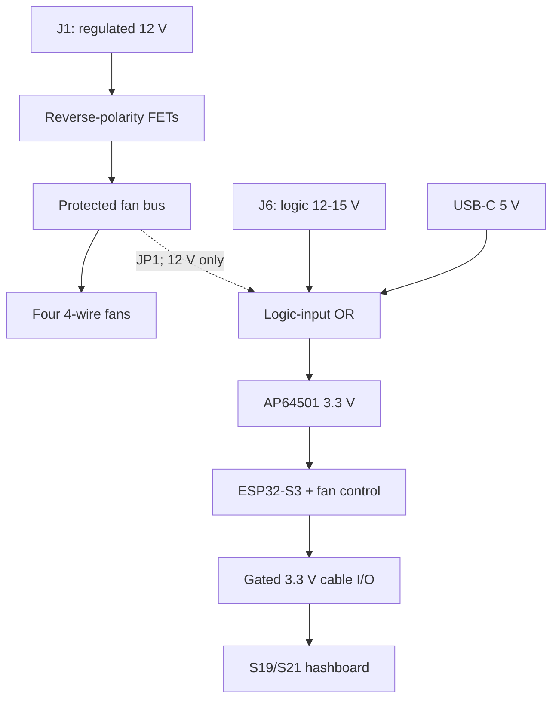

# Rev A.1 architecture

Rev A.1 is an ESP32-S3 miner/controller for one S19- or S21-family Bitmain hashboard and four AntHat-style 12 V fans. It talks to the hashboard only through the common data cable. Hashboard ASIC/core power remains on the external bus bars; there is no PSU connector, PSU enable signal, or PSU telemetry interface on this revision.

This is a schematic-entry architecture, not a production-qualified power controller. Every mining-capable firmware build must select one exact, tested hashboard profile.

## System boundary

The controller does not carry hashboard core current. Fan return, controller ground, and hashboard cable ground are common; the external hashboard power system must share that reference.

## Power domains

| Domain | Source | Intended load | Design rule |
|---|---|---|---|
| `FAN_12V` | `J1 FAN_12V_IN` through Q5/Q6 | Four fan motor supplies | Regulated 12 V only; size connector, reverse-polarity FETs, fuse, pours, and wiring from the actual fan nameplate current and inrush |
| `VIN_LOGIC_12_15` | `J6` | Controller logic | 12–15 V, low current; protected before the logic-input OR node |
| `USB_5V` | USB-C | Controller-only bring-up | Must not backfeed J1, J6, fan motor power, or hashboard pin 16 |
| `LOGIC_IN` | diode/ideal-diode OR of J6, USB, and optional J1 link | AP64501 input | Source isolation is required; populate `JP1 FAN_TO_LOGIC` only when J1 is a verified 12 V rail |
| `3V3` | AP64501 | ESP32-S3, EMC2305, buffers, sensors | Local logic rail |
| `HB_3V3` | 3V3 through TPS22917 | Hashboard cable pin 16 | Default off; reverse-current blocking; enabled only after a profile and cable checks pass |

A 15 V source must never be routed directly to nominal 12 V fans. A single regulated 12 V supply can feed both J1 and the logic regulator when JP1 is deliberately fitted. For a 13–15 V system, provide a separate regulated 12 V fan source; a future revision could add a high-current fan buck after the current requirement is known.

Recommended protection at schematic entry:

- an upstream, replaceable external fuse sized for all fan startup current and located close to the 12 V source;
- a low-loss high-current P-channel MOSFET reverse-polarity stage on J1, starting with two parallel `DMP3013SFV-7` candidates plus a gate resistor/Zener clamp; one device is not assumed to carry four-fan startup current, and the final FET count/thermal design must follow measurement;
- a series Schottky reverse-block/OR diode on J6 and a bidirectional `SMBJ18CA`-class provisional TVS so a normal reversed input does not forward-bias the shunt protector;
- an `SMBJ13A`-class starting TVS candidate on the protected 12 V fan bus, with standoff, clamp, pulse energy, and fan tolerance verified before release;
- bulk capacitance beside the fan input and each connector group, and local high-frequency decoupling at every IC; and
- no copper path that makes the AP64501 carry fan motor current.

## Hashboard cable interface

J10 is physically 2×9 / 18 positions. Positions 1–16 carry the common Bitmain signals and 17–18 are NC. Rev A.1 treats every cable-side logic signal as 3.3 V; exact pin mapping is in `connector-pinout.md`.

| Function | Circuit | Safe default |
|---|---|---|
| Pin-16 supply | TPS22917 load switch from 3V3 | Off by GPIO10 pulldown; reverse-current blocking |
| UART TX/RX and `PLUG` | SN74AXC4T774-class buffer, both sides at 3.3 V | Disabled by GPIO7 pull-up on active-low OE |
| SDA/SCL | Two channels of TMUX1511, powered by switched `HB_3V3`; local pull-ups to `3V3`, cable pull-ups to `HB_3V3` | Powered-off isolation when `HB_3V3` is absent; GPIO9 pulldown keeps both selects low |
| RESET | Independent SN74LVC1G125-class tri-state buffer plus DNP series `RESET_ENABLE_LINK` | Physical cable path open in the default S21-safe assembly; 10 kΩ pull-up also keeps the buffer high-impedance |
| A0/A1/A2 | 4.7 kΩ default-low straps plus mutually exclusive solder options to switched `HB_3V3` | Address 0; any nonzero setting is an explicit assembly/profile choice; never strap to always-on 3V3 |

The reset path is intentionally separate from the UART/plug buffer. GPIO1 carries the reset command and GPIO4 separately enables the reset driver. A 10 kΩ pull-up keeps the active-low enable inactive. There is no universal populated pull-up or pull-down on the cable RESET net; optional bias pads are DNP until the exact target proves a safe value. The series `RESET_ENABLE_LINK` is also DNP/open by default, which makes the first S21 BM1368 NoPIC assembly physically incapable of driving J10 RESET. A legacy-reset profile may populate that link with 33 Ω only after its exact reset sequence is validated. Public S21 work warns that legacy GPIO reset can collapse the hashboard's TAS5782M DAC-generated voltage.

Series resistors near the controller should be fitted on push-pull cable outputs, with footprints for damping adjustment after scope measurements. Put low-capacitance ESD parts at J10 without creating stubs. The connector shell/key/orientation and mating part remain procurement signoff items even though the signal map is fixed.

U7 is deliberately not a conventional dual-rail I²C level translator. The TMUX1511 is a bidirectional signal switch with powered-off protection to 3.6 V and fail-safe select inputs. Supplying it from `HB_3V3` makes both I²C paths high-impedance whenever the hashboard I/O supply is off, even while the controller-side pull-ups remain at 3.3 V. Only channels 1 and 2 are used; channels 3 and 4 are held off. The two 4.7 kΩ pull-up pairs appear in parallel while enabled, so the effective pull-up is about 2.35 kΩ. Firmware must deassert `HB_I2C_EN` before intentionally ramping `HB_3V3`, and the real cable must be checked for rise time, low-level margin, capacitance, and overshoot below the switch's 3.6 V powered-off limit.

## Fan subsystem

Each of four connectors follows the AntHat-style logical order `GND, +12V, TACH, PWM` and must use the same proven physical family and orientation at schematic release. The EMC2305 monitors tach and produces four PWM commands. Each command passes through a disabled-by-default SN74LVC126 stage and an external 2N7002 open-drain sink:

- `FAN_ARM` (GPIO8) is held low by hardware until firmware has configured and read back the EMC2305;
- 100 kΩ pulldowns on `EMC_PWM1..4` hold the buffer inputs low while the EMC2305 outputs are still open-drain at power-on, so even an erroneous early `FAN_ARM` leaves the external PWM sinks released;
- when the ESP, EMC2305, or buffer is unpowered, the sink gates remain inactive and PWM wires float;
- supported four-wire fans therefore use their internal pull-ups and request full speed on a floating PWM line; fans that do not provide a compatible internal PWM pull-up are outside the Rev A.1 supported profile.

Tach inputs need ESD protection, optional RC filtering, and voltage clamps compatible with the EMC2305 input limits. Firmware must validate tach age and plausible RPM on all configured required fans before mining.

## GPIO allocation

| GPIO | Function |
|---:|---|
| 1 | Hashboard RESET command input to independent tri-state buffer |
| 4 | `HB_RESET_OE_N`; pulled high |
| 5, 6 | Reserved expansion/test pads |
| 7 | Active-low hashboard UART/PLUG buffer OE; pulled high |
| 8 | `FAN_ARM`; pulled low |
| 9 | Hashboard I2C switch enable; pulled low |
| 10 | Hashboard pin-16 3.3 V enable; pulled low |
| 11 | Protected/divided rail monitor ADC |
| 12 | Hashboard `PLUG` input |
| 13 | EMC2305 ALERT input |
| 14, 21 | Hashboard SDA/SCL |
| 17, 18 | ASIC UART TX/RX |
| 47, 48 | Local EMC2305 SDA/SCL |

USB uses the ESP32-S3 native USB pins and must follow Espressif's routing and antenna guidance.

## Startup and fault ownership

Hardware pull resistors establish a safe state before the ESP boots: fans request full speed, hashboard pin 16 is off, UART/I2C/reset drivers are high-impedance, and mining is impossible. One firmware safety state machine owns every interface enable and the `mining_allowed` decision.

Because Rev A.1 intentionally omits PSU control, it cannot guarantee removal of externally supplied hashboard core power. On a fault it can stop sending work, issue a tested hashboard-local I2C shutdown/voltage-off command when the selected profile supports one, disable cable interfaces in the profile-defined safe order, and release fan PWM for full-speed cooling. If the local shutdown path is absent or fails, the external supply must be disconnected by the operator or an independent protection system. This limitation must remain visible in the UI and release documentation.

## Profile boundary

Connector compatibility does not make the ASIC protocol universal. Each firmware profile must fix at least the ASIC family, chip count, address stride, initial and operating baud, reset policy, I2C devices, voltage-control sequence, temperature interpretation, and shutdown behavior. Unknown or ambiguous boards remain in diagnostic mode. The current priority is BM1368 S21, followed by exact BM1366 S19 XP/S19k profiles and then BM1370 S21 variants; see `target-matrix.md`.

## PCB consequences

- Keep the high-current fan band at the board edge and away from USB, the ESP antenna, UART, tach, and I2C routing.
- Route J1-to-fan power with short top-and-bottom pours and dense via stitching; calculate width and connector temperature rise from the measured worst-case current.
- Keep J6/logic protection and AP64501 switching loops compact and physically separate from fan PWM/tach and the ESP antenna.
- Place all J10 protection, series resistors, translators, and load switch in one short interface lane at the cable connector.
- Expose test points for J1, J6, LOGIC_IN, 3V3, HB_3V3, fan PWM/tach, UART, I2C, RESET, all OEs, and ground.
- Preserve the ESP module's board-edge antenna position and 15 mm copper/component keepout.

## Release blockers

Before fabrication release, capture the exact S19/S21 cable connector manufacturer/part number, fan connector family/orientation, fan maximum current and inrush, protection ratings, AP64501 magnetics/compensation, exact first hashboard SKU, and a verified local voltage-off path. Before enabling mining, prove interface waveforms, full-chain enumeration, thermal sensing, all four fan-fault paths, watchdog behavior, and the limitations of shutdown without PSU control.
